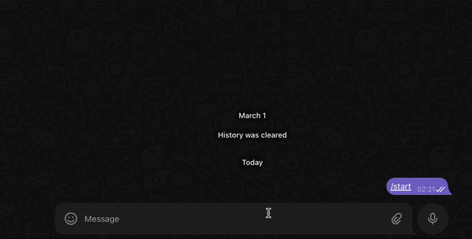

## Пример java кода, работа с классами и объектами на примере Telegram бота

Проект демонстрирует работу с объктами и перегрузкой конструкторов на примере абстракций API Telegram  и класса с бизнес логикой.

Для теста работы бота следуем инструкции:
1. Скачиваем репозиторий или клонируем проект командой
   ```
       git clone git@github.com:GoetzDeBouville/JavaTelegramBotExample.git
   ```
2. В папке /src/main/java/org/example/config/ создаем класс BotConfig следующего содержания:
```java
public class BotConfig {
    public static final String BOT_NAME = "botname";
    public static final String TOKEN = "my_token";
}
```
где botname и my_token это данные вашего бота.

3. Запускаем проект в консоли и получаем такой результат:
 

Для изучения проекта по шагам используем комбинацию клавиш Ctrl+Shift+F (или  commannd+shift+F для mac)
и в поисковой строке прописываем STEP n, где n  это номер шага (всего их 3) 
Предыдущую версию кода с реализацией класса Main можно посмотреть в ветке [comments](https://github.com/GoetzDeBouville/JavaTelegramBotExample/tree/comments)